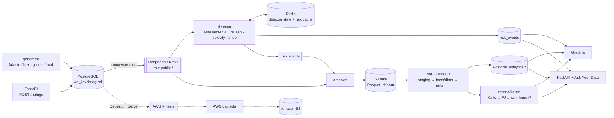

# Real-Time Marketplace Trust & Data Platform

A mini Dubizzle-style classifieds marketplace (property, cars, general classifieds) where **every database change is
captured with CDC, scored for trust problems in ~100 ms, archived to a Parquet lake, modelled with dbt, and
reconciled end to end** so no event silently disappears between the stream and the warehouse.




## What it shows

| Area | Implementation |
|---|---|
| **CDC** | Debezium (Kafka Connect, `pgoutput`) streams `sellers`, `listings` (REPLICA IDENTITY FULL so updates carry the old price) and `listing_interactions` into Redpanda |
| **Real-time detection** | `processor/stream.py detect`: near-duplicate text (MinHash + LSH banding, 64 perms / 16 bands), duplicate images (64-bit perceptual hash, multi-index hamming search), seller velocity (Redis sorted sets, ≥10 listings / 10 min), one phone across many accounts, price anomalies vs area medians (property benchmark) or rolling medians (cars/classifieds), price churn. Noisy-OR score → `OK / WATCH / REVIEW` — flags mean "review", never "fraud" |
| **Delivery guarantees** | Offsets committed only after Postgres + Redis + Kafka writes; `risk_events` has a unique key on the source offset, so replays are idempotent; poison messages go to a DLQ topic |
| **Raw lake** | `processor/stream.py archive` writes Kafka messages as Parquet to S3 (`raw/topic=/dt=/hour=`), committing offsets only after the upload (at-least-once; dbt dedups on topic/partition/offset) |
| **Warehouse (dbt + DuckDB)** | 5 staging models → `fact_listing_events`, `fact_listing_interactions`, `fact_risk_events`, `dim_listing`, `dim_seller`, `dim_category`, `dim_location` → `mart_seller_health`, `mart_listing_quality` (freshness / stale inventory), `mart_marketplace_funnel`, `mart_trust_metrics`. 25 data tests |
| **Reconciliation** | `batch/run.py` snapshots the archiver's committed offsets, then checks **Kafka offsets = distinct offsets in S3 = rows in the warehouse** per topic, and reports duplicates written to the lake and events still in flight → `recon_results` + Grafana |
| **Data product** | FastAPI: `GET /listings/{id}/risk`, `/sellers/{id}/health`, `/marketplace/metrics`, `/trust/events`, `/funnel/summary`, plus the marketplace write path (`POST/PATCH/DELETE /listings`) |
| **Ask-Your-Data** | `POST /ask`: LangGraph (schema from dbt docs → SQL → **sqlglot** guard: single SELECT, `analytics.*` only, LIMIT → execute as a read-only Postgres role with timeout → answer + chart spec), retries on validation/SQL errors |
| **Cloud path** | Debezium Server → **AWS Kinesis** → **AWS Lambda** (same detector code, stateless price check) → Parquet on **Amazon S3**; `aws/deploy.sh` / `aws/deploy.sh teardown` |
| **Ops** | Grafana dashboard provisioned from code (events/sec, consumer lag, p50/p95 latency, alerts, DLQ errors, reconciliation, funnel); GitHub Actions: ruff, pytest, dbt build on a committed lake sample |

## Results (laptop, Docker Desktop, ~30 events/s)

| Metric | Value |
|---|---|
| Commit → risk score latency (steady state) | **p50 ≈ 110 ms, p95 ≈ 250–350 ms** (Postgres commit → Debezium → Redpanda → detector → stored) |
| Reconciliation, 4 topics, ~26k events | Kafka 10,127 / S3 10,127 / warehouse 10,127 on `listings`; **0 mismatches** on every topic |
| dbt | 41 nodes, 40 pass + 1 warn (interactions on listings not yet archived) |
| Tests | 16 pytest (detectors, sqlglot guardrails, Lambda handler) |

Break it on purpose: delete a Parquet file from the lake, or stop the archiver mid-batch, and the next reconciliation
reports the missing or duplicated events.

## Run it

```bash
docker compose up -d --build      # postgres, redpanda, debezium, redis, s3, detector, archiver, generator, batch, api, grafana
```

| | |
|---|---|
| Grafana | http://localhost:3000 (dashboard "Marketplace Trust & Data Platform") |
| API docs | http://localhost:8000/docs |
| Kafka | `localhost:19092` · Debezium REST `localhost:8083` · S3 `localhost:8333` · Postgres `localhost:5432` |

```bash
curl localhost:8000/listings/123/risk
# {"listing_id":123,"risk_score":0.74,"flags":["near_duplicate","seller_velocity"],"status":"REVIEW","latency_ms":98}
docker compose exec batch python batch/run.py --once   # stop the batch service first to avoid the DuckDB lock
```

**Ask-Your-Data**: copy `.env.example` to `.env`, set `LLM_MODEL` (e.g. `anthropic:claude-sonnet-5` or any
OpenAI-compatible model) and its key, `docker compose up -d api`, then
`curl -X POST localhost:8000/ask -H 'content-type: application/json' -d '{"question":"Which locations have the lowest view-to-lead rate this week?"}'`.

**AWS**: `aws login`, then `bash aws/deploy.sh` (region `me-central-1` by default), `docker compose --profile aws up -d debezium-server`,
watch `aws logs tail /aws/lambda/mkt-trust-processor --follow`, and `bash aws/deploy.sh teardown` when done.

## Layout

```
postgres/init.sql        OLTP schema, risk/metrics/recon tables, analytics schema + read-only role
connect/mkt-cdc.json     Debezium connector
generator/generate.py    fake marketplace traffic with duplicate reposts, bursts, shared phones, price outliers, churn
processor/detectors.py   pure detection functions (shared with Lambda)
processor/stream.py      detect + archive consumers
batch/run.py             dbt build → publish marts → reconcile
dbt/                     staging / core / marts + tests
api/                     FastAPI + LangGraph Ask-Your-Data
aws/                     Lambda handler, Debezium Server config, deploy/teardown script
grafana/                 datasource + dashboard as code
```

Known limits: the Lambda path is stateless (duplicate/velocity need shared state — ElastiCache/DynamoDB would add them);
the warehouse is DuckDB published to Postgres for serving, standing in for Redshift/Snowflake/BigQuery.
